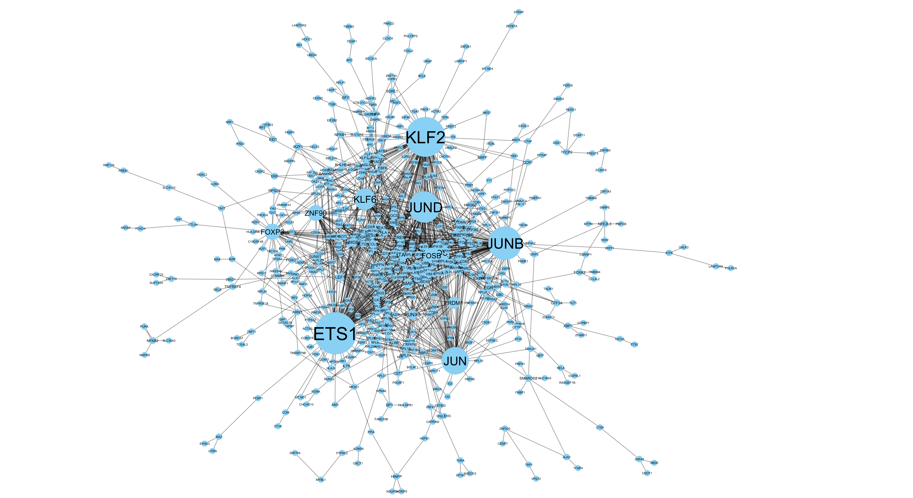

```{r setup, include=FALSE}
knitr::opts_chunk$set(echo = TRUE)
```

```{css, echo=FALSE}
.list-group-item.active, .list-group-item.active:hover, .list-group-item.active:focus {
    color: #ffffff;
    background-color: #333333;
}
p {
  color: #333333;
}
```

## Introduction 

From the previous session, we have succesfully generated a working Seurat object with proper clustering, cell type annotation, and dimension reduction. An important task in any bioinformatics analysis (not unique to scRNA-seq analysis) is to identify biological patterns given the data set. Furthermore, as a bioinformatician, it is expected for us to come up with targets and/or mechanism that is found from the analysis that can be validated and reproduced in the wet lab. In this tutorial, we used the breast cancer dataset again [(from this paper)](https://www.sciencedirect.com/science/article/pii/S0092867418307232) which described the immune microenvironment of breast cancer tumours by performing droplet-based scRNA-seq of CD45+ cells from breast cancer patients.

We will perform the following tasks:

- Pathway enrichment analysis
- Transcription factors inference
- Gene regulatory network Inference
- Trajectory inference (pseudotime analysis)

## Load data and libraries

```{r, load_libraries, message=FALSE, warning=FALSE}
options(future.globals.maxSize = 10 * 1024^3) 

# load libraries
library(devtools)
library(tidyverse) # install.packages("tidyverse")
library(Seurat) # install.packages('Seurat')
library(clustree) # install.packages("clustree")
library(ggsignif) # install.packages("ggsignif")
library(gprofiler2) # BiocManager::install("clusterProfiler")
library(org.Hs.eg.db) # BiocManager::install("org.Hs.eg.db")
library(ggrepel) # install.packages("ggrepel")
library(patchwork) # devtools::install_github("thomasp85/patchwork")
library(SingleCellExperiment) # BiocManager::install("SingleCellExperiment")
library(SCPA) # devtools::install_github("jackbibby1/SCPA")
library(msigdbr) # install.packages("msigdbr")
library(decoupleR) # BiocManager::install('saezlab/decoupleR')
library(pheatmap) # install.packages("pheatmap")
library(monocle3) # devtools::install_github('cole-trapnell-lab/monocle3')
library(SeuratWrappers) # remotes::install_github('satijalab/seurat-wrappers')
library(harmony) # install.packages("harmony")
```

```{r, read_data, cache=TRUE}
# read in processed data from tutorial 1
dat.combined <- readRDS('breast_cancer_scRNA_processed.Rds')
DefaultAssay(dat.combined) <- "RNA"
head(dat.combined@meta.data)
```


## Pathway enrichment analysis

A straightforward way to gain a functional understanding of biological functions in our dataset is through pathway enrichment analysis. There are mainly two ways this can be done, over-representation analysis (ORA) and gene set enrichment analysis (GSEA). 

- ORA: With this method, we input a list of gene names and the algorithm run a permutation-type test to evaluate whether there is a significant enrichment (over-representation) of our list relative to random. While this method is simple and powerful, it lacks the directionality of the pathways.

- GSEA: Wit this method, similar to ORA, we input the list of genes alongside its associated weights (LFC, t-score, p-value, etc). GSEA uses Kolmogorov-Smirnov-like statistic to test if small steps of changes of the gene list take together significantly differ from the background. Unlike, ORA analysis, GSEA allows us to infer directionality between groups of interest.

```{r, ORA, warning=F}
# DE analysis for ORA
deg_df <- data.frame()
for(i in unique(dat.combined$cell_type_major)){
  sub <- dat.combined[, dat.combined$cell_type_major == i]
  tryCatch({
    degs <- FindMarkers(sub, assay = 'RNA', group.by = 'tissue', ident.1 = 'TUMOR', ident.2 = 'NORMAL')
    degs <- degs %>% rownames_to_column(var = 'gene') %>% mutate(cell = i)
    deg_df <- rbind(deg_df, degs)
  }, error=function(e){cat("ERROR :",conditionMessage(e), "\n")})
}

deg_df_signif <- deg_df %>% dplyr::filter(p_val_adj < 0.05 & abs(avg_log2FC) > log2(1.5))
deg_df_signif_list <- split(deg_df_signif, deg_df_signif$cell)


# Run ORA with gprofiler
gene_list_to_test <- lapply(deg_df_signif_list, function(x) {
  return(as.character(x$gene)) # Replace 'gene' with your actual column name
})

res_KEGG <- tryCatch({
  gost(
    query = gene_list_to_test,
    organism = "hsapiens", 
    ordered_query = FALSE,
    multi_query = FALSE,
    sources = "KEGG",
    user_threshold = 0.05,
    correction_method = "fdr"
  )
}, error = function(e) {
  message("Critical error running gost: ", e$message)
  return(NULL)
})
res_KEGG <- res_KEGG$result

ggplot(res_KEGG, aes(
    x = -log10(p_value), 
    # Reorder term_name by the -log10(p_value) value
    y = reorder(term_name, -log10(p_value)), 
    fill = query
  )) +
    geom_col() +
    facet_grid(~query) +
    theme_minimal() +
    labs(
      x = "-log10(p-value)",
      y = "KEGG Pathway",
      title = "Enriched KEGG Pathways"
    ) +
    theme(legend.position = "none")
```
From above results, we have seen that different significant functional erncihments was identified in different cell types when comparing for TUMOR vs NORMAL. For instance, we identified the enrichment of immune related functions, such as MAPK, PI3K-AKT, and antigen presentation. To look depeer into the directionality of these pathways, we performed GSEA below.

```{r, GSEA, warning=F, results='hide', echo=F}
# load KEGG pathways
msigdbr_df_C2 <- msigdbr(species = "human", category = "C2")
msigdbr_df_KEGG <- msigdbr_df_C2 %>% dplyr::filter(gs_subcat %in% "CP:KEGG_LEGACY") %>% format_pathways()

cell_types <- c("MONOCYTE","NK","T")
scpa_results_list <- list()

for (cell in cell_types) {
  message("Processing: ", cell)
  norm_sub <- seurat_extract(dat.combined, 
                             meta1 = "cell_type_major", value_meta1 = cell,
                             meta2 = "tissue", value_meta2 = "NORMAL")
  
  tum_sub  <- seurat_extract(dat.combined, 
                             meta1 = "cell_type_major", value_meta1 = cell,
                             meta2 = "tissue", value_meta2 = "TUMOR")
  
  if (ncol(norm_sub) > 10 && ncol(tum_sub) > 10) {
    
    scpa_results_list[[cell]] <- tryCatch({
      SCPA::compare_pathways(
        samples = list(tum_sub, norm_sub), 
        pathways = msigdbr_df_KEGG, 
        downsample = 1200
      )
    }, error = function(e) {
      message("Error in SCPA for ", cell, ": ", e$message)
      return(NULL)
    })
    
  } else {
    message("Skipping ", cell, ": Insufficient cells in one or both groups.")
  }
}

scpa_results_list_signif <- scpa_results_list
for(i in 1:length(scpa_results_list)){
  scpa_results_list_signif[[i]] <- scpa_results_list_signif[[i]] %>% dplyr::filter(adjPval < 0.05 )  
  scpa_results_list_signif[[i]]$cell <- names(scpa_results_list_signif)[i]
}
scpa_results_list_signif <- do.call(rbind, scpa_results_list_signif)

```

```{r}
ggplot(scpa_results_list_signif, aes(
    x = FC, 
    y = reorder(Pathway, FC), 
    fill = cell
  )) +
    geom_col() +
    facet_grid(~cell, scales = "free_y") +
    theme_minimal() +
    labs(
      x = "Fold Change",
      y = "KEGG Pathway",
      title = "Enriched KEGG Pathways"
    ) +
    theme(legend.position = "none")
```


## Transcription factors enrichment

In RNA-seq experiment, an important analysis is to identify active transcription factors (TF). Typically, if we look at only the expression profile, we would not see large differences between groups. We will use, Decoupler linear method utilizing COllecTRI as the TF-targets database to model TF activities. This method works by evaluating expected TF-targets interaction and matching it to actual observation using linear estimation. There are two ways these analysis can be done, first by inputting statistical test score or the count matrix directly. In this tutorial, we will try to directly input the count matrix but we will down sample to reduce the time complexity.

```{r}
load("TFN.RData")
# Downsample
dat.combined$cell_tissue <- paste0(dat.combined$cell_type_major,"_",dat.combined$tissue)
counts <- table(dat.combined$cell_tissue)
keep_groups <- names(counts[counts >= 50])
dat.filtered <- subset(dat.combined, subset = cell_tissue %in% keep_groups)
Idents(dat.filtered) <- "cell_tissue"
dat.filtered <- subset(dat.filtered, downsample = 500)


# Run DecoupleR ULM
sample_acts <- decoupleR::run_ulm(mat = dat.filtered@assays$RNA@counts, 
                                  net = TFN, 
                                  .source = 'source', 
                                  .target = 'target',
                                  .mor = 'mor', 
                                  minsize = 5)
meta_join <- dat.filtered@meta.data
meta_join$condition <- rownames(meta_join)
meta_join <- meta_join %>% dplyr::select(condition, cell_tissue)

sample_acts <- left_join(sample_acts, meta_join)

sample_acts_agg <- sample_acts %>%
  dplyr::filter(p_value < 0.1) %>%
  dplyr::group_by(source, cell_tissue) %>%
  dplyr::summarise(mean_score = mean(score, na.rm = TRUE), .groups = "drop")

top_30_tfs <- sample_acts_agg %>%
  dplyr::mutate(abs_score = abs(mean_score)) %>%
  dplyr::group_by(source) %>%
  dplyr::summarise(max_abs = max(abs_score), .groups = "drop") %>%
  dplyr::slice_max(max_abs, n = 30) %>%
  dplyr::pull(source)
top_30_tfs <- c(top_30_tfs, "NFKB1", "EGR1", "JUN", "FOS", "BATF")

sample_acts_agg_top30 <- sample_acts_agg %>% dplyr::filter(source %in% top_30_tfs)
sample_matrix <- sample_acts_agg_top30 %>%
  pivot_wider(names_from = cell_tissue, values_from = mean_score) %>%
  column_to_rownames("source") %>%
  as.matrix()
sample_matrix[is.na(sample_matrix)] <- 0

# thresholding (for viz only)
sample_matrix_clipped <- sample_matrix
sample_matrix_clipped[sample_matrix_clipped > 7] <- 7
sample_matrix_clipped[sample_matrix_clipped < -7] <- -7

pheatmap(
  t(sample_matrix_clipped),
  clustering_method = "complete",
  color = colorRampPalette(c("navy", "white", "firebrick3"))(200),
  border_color = "white",
  scale = "none",  # Don't scale if mean_score is already a Z-score/Activity score
  main = "TF Activity by Tissue",
  fontsize_row = 8,
  angle_col = 45,
  cluster_rows = T
)
```

## GRN Inference

Gene Regulatory Network (GRN) identify the directional and functional relationships between transcription factors and their target genes. While the previous TF enrichment step identifies which "drivers" are active, GRN inference reconstructs the "circuitry" of the cell. In this case, we can see how changes in one gene or gene hubs affect the gene network as a whole. We will use SCENIC to infer GRN from our dataset. However, the R implementation is very slow and prone to memory error. As such, we will use the Docker implementation which is much faster. The Docker file is linked in the GitHub as well. For this analysis, we will only focus on the GRN of T-cells.


```{r, GRN}
# save count matrix for SCENIC
# dat.T.cell <- subset(dat.combined, subset = cell_type_major %in% "T")
# 
# temp <- dat.T.cell@assays$RNA@data
# temp <- temp[rowSums(temp) >= 50, ]
# temp <- as.data.frame(temp)
# write.table(temp, "Input_Scenic.tsv", sep = "\t")
# rm(temp)

Regulon_df <- read.csv("SCENIC_Output/MSC_regulon.csv")
Regulon_mtx <- read.csv("SCENIC_Output/MSC_auc_mtx.csv")
GRN <- read.csv("SCENIC_Output/MSC_adj.csv")

rownames(Regulon_mtx) <- gsub("(+)", "", rownames(Regulon_mtx), fixed = TRUE)

col_names_regulon <- c("TF", "MotifID", "AUC", "NES", "MotifSimilarityQvalue", "OrthologousIdentity", 
                       "Annotation","Context", "TargetGenes", "RankAtMax")
colnames(Regulon_df) <- col_names_regulon
Regulon_df <- Regulon_df[-c(1,2,3),]
Motif_TF <- unique(Regulon_df$TF)

GRN_signif <- GRN %>% dplyr::filter(importance > 5 & TF %in% Motif_TF)

write.csv(GRN_signif, "GRN_Signif.csv")
```

```{r include-grn, echo=FALSE, out.width="80%"}

```

## Trajectory inference (pseudotime)

Biological processes, such as cell differentiation and disease progression, occurs in a continous manners i.e. even major/rapid changes happen in a continous manner not a simple on/off switch. Trajectory inference (or pseudotime analysis) allows us to order cells along a backbone that represents this biological "time" based on similarities in their transcriptomic profiles. Similar to GRN analysis, we will only use the T-cell subset.

```{r, Trajectory}
# preprocess_data 
dat.T.cell <- subset(dat.combined, subset = cell_type_major %in% "T")
meta_T <- dat.T.cell@meta.data

seurat_T <- CreateSeuratObject(counts = dat.T.cell@assays$RNA$counts, assay = "RNA", meta.data = meta_T)
seurat_T <- seurat_T %>%
    Seurat::NormalizeData(verbose = FALSE) %>%
    FindVariableFeatures(selection.method = "vst", nfeatures = 2000) %>% 
    ScaleData(verbose = FALSE) %>% 
    RunPCA(npcs = 20, verbose = FALSE) %>%
    RunHarmony("patient", plot_convergence = F) %>%
    RunUMAP(reduction = "harmony", dims = 1:20) %>% 
    FindNeighbors(reduction = "harmony", dims = 1:20) %>% 
    FindClusters(resolution = 0.7) %>% 
    identity()
DimPlot(seurat_T, group.by = "patient")

# Run pseudotime inference
CD8_Pan <- seurat_T

DefaultAssay(CD8_Pan) <- "RNA"
cds_Pan <- as.cell_data_set(CD8_Pan)
cds_Pan <- cluster_cells(cds_Pan)

dimnames <- attributes(cds_Pan@reduce_dim_aux$gene_loadings)["dimnames"][[1]]
upper_case <- unlist(lapply(dimnames[[2]], function(x) toupper(x)))
dimnames[[2]] <- gsub("HARMONY", "PC", upper_case)
attr(cds_Pan@reduce_dim_aux$gene_loadings, "dimnames") <- dimnames


integrated.sub <- Seurat::as.Seurat(cds_Pan, assay = NULL)
cds_Pan <- as.cell_data_set(integrated.sub)
cds_Pan <- learn_graph(cds_Pan, use_partition = F)
max.node <- which.max(unlist(FetchData(integrated.sub, "SELL")))
max.node <- colnames(integrated.sub)[max.node]

cds_Pan_ordered <- order_cells(cds_Pan, root_cells = max.node)

library(RColorBrewer)
test <- cds_Pan_ordered@principal_graph_aux@listData$UMAP$pseudotime %>% as.data.frame()
test$cellid <- rownames(test)
colnames(test) <- c("pseudotime", "cellid")

CD8_Pan@meta.data$cellid <- rownames(CD8_Pan@meta.data)
CD8_Pan@meta.data <- left_join(CD8_Pan@meta.data, test)
rownames(CD8_Pan@meta.data) <- CD8_Pan@meta.data$cellid

plot_cells(cds_Pan_ordered, color_cells_by = "pseudotime", label_cell_groups = FALSE, label_leaves = FALSE,
           label_branch_points = FALSE, trajectory_graph_color = "black") +
    labs(title = "Pseudotime") +
    scale_colour_gradientn(colours = rev(brewer.pal(n = 11, name = "RdBu")))
FeaturePlot(CD8_Pan, "JUN") 
FeaturePlot(CD8_Pan, "SELL") 
```


